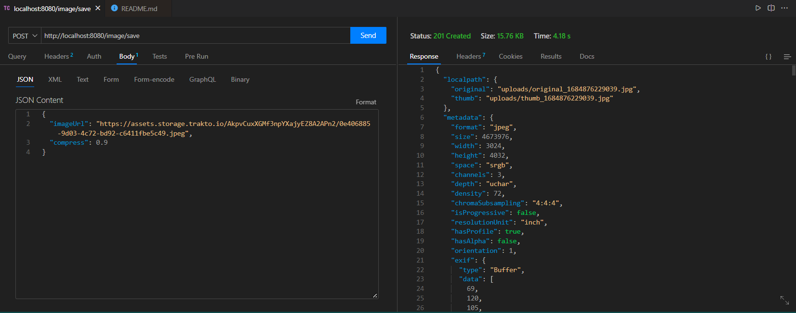

# Image API - Desafio Técnico Back-end da Trakto

<p align="center">
  
</p>

> Este é um projeto de uma API Rest desenvolvida utilizando o framework NestJS e o banco de dados MongoDB. O objetivo do projeto é fornecer um único endpoint que recebe uma URL pública de uma imagem JPG, salva essa imagem no sistema de arquivos, gera uma versão reduzida da imagem e armazena os metadados contidos no EXIF da imagem original em uma instância do MongoDB.

## Pré-requisitos

Antes de executar o projeto, certifique-se de ter as seguintes dependências instaladas:

- `Node.js` (versão 12 ou superior)
- `NPM` (gerenciador de pacotes do Node.js)
- `MongoDB` (instância local ou remota)

## Como executar o projeto

Siga as etapas abaixo para executar o projeto em sua máquina local:

Execute os seguintes comandos a partir da pasta raiz do projeto:

### Clone este repositório

```bash
git clone git@github.com:anaelisaq/image-api.git
```

### Acesse o diretório do projeto:
```bash
cd image-api
```

### Instale as dependências

```bash
npm install
```

### Defina as variáveis de ambiente

- Renomeie o arquivo `.env.example` para `.env`.
- Edite o arquivo `.env` e configure as variáveis de ambiente necessárias, como a URL do banco de dados MongoDB que estão divulgados a nível de teste da aplicação.

### Execute o Projeto

```bash
npm run start
```
ou
```bash
npm run start:dev
```
## Endpoints

- `POST /image/save`: Realiza o upload de uma imagem a partir de uma URL pública. A imagem é salva no sistema de arquivos, uma versão reduzida é gerada e os metadados do EXIF são armazenados no MongoDB.
## Estrutura de Pastas

A estrutura de pastas do projeto é organizada da seguinte maneira:

```
📂 assets
📂 src
┣ 📂 config
┃ ┗ 📜 swagger.ts
┣ 📂 image
┃ ┣ 📂 dtos
┃ ┃ ┗ 📜 image-update.dto.ts
┃ ┣ 📜 image-upload.service.ts
┃ ┣ 📜 image.controller.ts
┃ ┣ 📜 image.module.ts
┃ ┗ 📜 image.schema.ts
┣ 📜 app.module.ts
┗ 📜 main.ts
📂 test
┣ 📜 image.controller.spec.ts
📂 uploads
📜 .env.example
```
## Exemplo de payload:
<p align="center">
</p>
<br>
